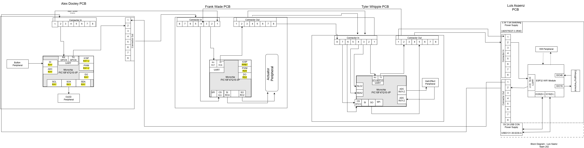
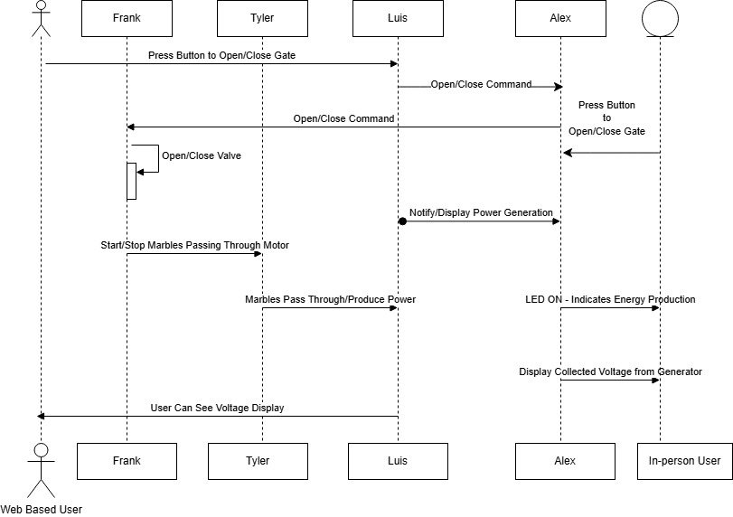

# Block Diagram, Process Diagram, and Message Structure

## Block Diagram

## Process Diagram

## Message Structure

| Message Type   1 Byte   (int8_t)            | Description |
| --------------------------------------------- | ----------- |
|1                                              | Set motor X in Y in direction |
|2                                              | Print sensor X value Y |
|3                                              | Subsystem Wifi Error Message |
|4                                              | Subsystem Wifi Status X |
|5                                              | Subsystem X is not communicating |
|6                                              | Motor Status, X |
|7                                              | Sensor Status, X |
|8                                              | Broadcast |

### Team ID

|  | Alex | Luis | Frank | Tyler |
|--|------|------|-------|-------| 
|Team Id (char) | a | b | c | d |

### Message Type 1:

| Byte 1 (char) | Byte 2 (char) | Byte 3 (char) | Byte 4 (char) | Byte 6 (int8_t) | Byte 6 (char) | Byte 7 (char) | Byte 8 (char) | Byte 9 (char) |
| --------------| ------------- | ------------- | ------------- | ------------- | --------------- | ---------------- | -------------- | ------------ |
| A | Z | Source ID (char)| Dest ID (char)| Message Type (int8_t)|  X(char) | Y(char) | Y | B |

### Message Type 2:

| Byte 1 (char) | Byte 2 (char) | Byte 3 (char) | Byte 4 (char) | Byte 5 (int8_t) | Byte 6 (char) | Byte 7 (int8_t) | Byte 8 (char) | Byte 9 (char) |
| --------------| ------------- | ------------- | ------------- | ------------- | --------------- | ---------------- | -------------- | ------------ |
| A | Z | Source ID (char)| Dest ID (char)| Message Type (int8_t)| X(char) | Y(int8_t) | Y | B |

### Message Type 3:

| Byte 1 (char) | Byte 2 (char) | Byte 3 (char) | Byte 4 (char) | Byte 5 (int8_t) | Byte 6-55 (string) | Byte 56 (char) | Byte 57 (char) |
| --------------| ------------- | ------------- | ------------- | --------------- | ---------------- | -------------- | --------- |
| A | Z | Source ID (char)| Dest ID (char)| Message Type (int8_t)| String | Y | B |

### Message Type 4:

| Byte 1 (char) | Byte 2 (char) | Byte 3 (char) | Byte 4 (char) | Byte 5 (int8_t) | Byte 6 (uint8_t) | Byte 7 (char) | Byte 8 (char) |
| --------------| ------------- | ------------- | ------------- | --------------- | ---------------- | -------------- | --------- |
| A | Z  | Source ID (char)| Dest ID (char)| Message Type (int8_t)| X(uint8_t) | Y | B |

### Message Type 5:

| Byte 1 (char) | Byte 2 (char) | Byte 3 (char) | Byte 4 (char) | Byte 5 (int8_t) | Byte 6 (char) | Byte 7 (char) | Byte 8 (char) |
| --------------| ------------- | ------------- | ------------- | --------------- | ---------------- | -------------- | --------- |
| A | Z | Source ID (char)| Dest ID (char)| Message Type (int8_t)|  X(char) | Y | B |

### Message Type 6:

| Byte 1 (char) | Byte 2 (char) | Byte 3 (char) | Byte 4 (char) | Byte 5 (int8_t) | Byte 6 (uint8_t) | Byte 7 (char) | Byte 8 (char) |
| --------------| ------------- | ------------- | ------------- | --------------- | ---------------- | -------------- | --------- |
| A | Z | Source ID (char)| Dest ID (char)| Message Type (int8_t)| X(uint8_t) | Y | B |

### Message Type 7:

| Byte 1 (char) | Byte 2 (char) | Byte 3 (char) | Byte 4 (char) | Byte 5 (int8_t) | Byte 6 (uint8_t) | Byte 7 (char) | Byte 8 (char) |
| --------------| ------------- | ------------- | ------------- | --------------- | ---------------- | -------------- | --------- |
| A | Z | Source ID (char)| Dest ID (char)| Message Type (int8_t)| X(uint8_t) | Y | B |

### Message Type 8:

| Byte 1 (char) | Byte 2 (char) | Byte 3 (char) | Byte 4 (uint8_t) | Byte 5 (int8_t) | Byte 6-55 (string) | Byte 56 (char) | Byte 57 (char) |
| --------------| ------------- | ------------- | ------------- | --------------- | ---------------- | -------------- | ------------ |
| A | Z | Source ID (char) | X | Message Type (int8_t)| String | Y | B |

#### Wifi Status Code Key

<li>Connected:     1 </li>
<li>Not Connected: 0 </li>