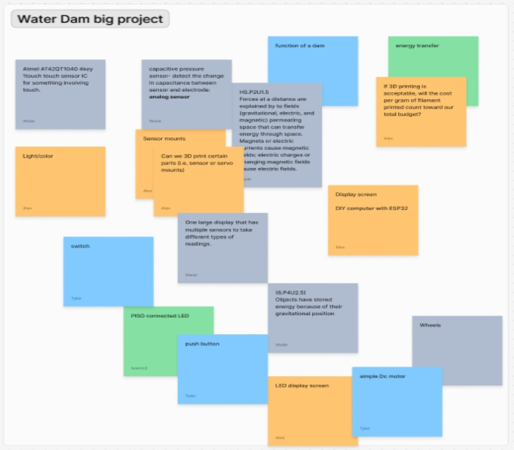
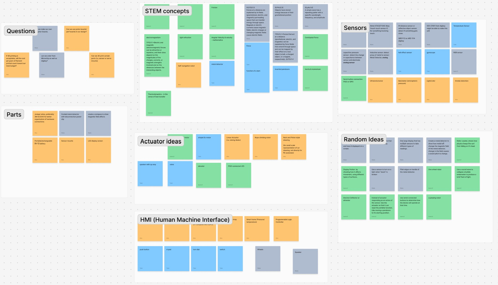
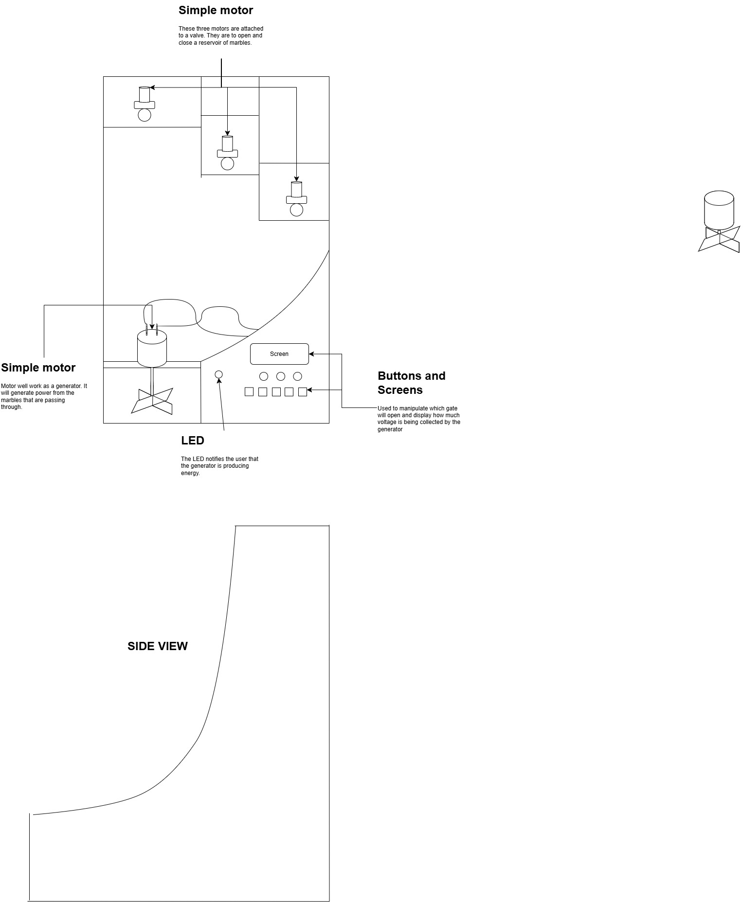

# The Exhibit
**This exhibit** is a way to show young adults that everything, both large or small can have energy. The *energy* on display is **gravitational potential** energy which can change if the height of the spheres changes. The transfer of energy between the falling sphere and the lightbulb is done with the aid of a generator. 

**The audience** for this exhibit are middle schoolers to highschoolers. Hydroelectric plants have been turning out kilowatts of power for almost 150 years. Today the southwest uses wind power, solar power, and nuclear power to provide energy.

# Phases of Brainstorming
## Phase One

## Phase Two

## Final Phase

# Design Sketch

## Description
The concept sketch can be described as an interactive exhibit. The goal of the exhibit is to use S.T.E.M. to create an exhibit that will inspire students, ranging from 6th to 12th grade, about S.T.E.M. The concept sketch shows the increase in potential energy stored in objects at higher elevation and how we can use different means to capture that energy and transfer it. What makes it an interactive exhibit is that the user can choose what height level to release the “water” down the ramp as well as choose the volume of “water” retreating from our reservoir. How the exhibit functions; first, there are three motors attached to 3 different valves and reservoirs. The motors will open and close the valve to release marbles, “water”, down the ramp, exiting through another simple motor to collect and distribute energy to a nearby LED. Several buttons will be used so that the user can choose the desired parameters for the exhibit. After parameters are entered and the exhibit is on, an LED screen will display the amount of voltage being produced by the generator, simple motor. When the exhibit is connected to a user’s device, the user will have the same function as the buttons.
	
When designing the device team 202 will attempt to keep it simple in function and aesthetic. Although our target audience are students who are 6th to 12th grade, we would like students below the 6th grade to see the exhibit and understand how to function it as well. To keep it simple, if we have to provide an instruction document on how to operate the exhibit, it will be a single page and straight to the point. We also plan to apply informative art, or text, next to buttons to facilitate smoother operating. Such as, L1, L2, and L3, these variables would be next to the buttons, referring to the different elevations of the exhibit,  as well as labeled again at the elevation it is referring to. The exhibit is operated and only interactive through buttons, our only safety concern is if the buttons to interact with the device are too close to the exit of the marbles. To combat this we may change the exit of the marbles or the placement of the buttons. Regarding durability and comfort, we expect the marbles to produce a minimal amount of destructive force going down the ramp and therefore do not expect durability to play a large role in our exhibit. Because the exhibit is operated through buttons and designed to display information, comfort does not play a role in our exhibit. Once our buttons are labeled, another useful tool to operate the exhibit will be an instruction page. As stated above, the instruction page will be short. The instructions will be a single page with digestible terminology on how to operate the exhibit and the steps will be numbered to limit human error and decide the direction of interaction with the exhibit.

## Link to presentation
[Powerpoint Presentation](https://youtu.be/2j3AWLGC9YM)
